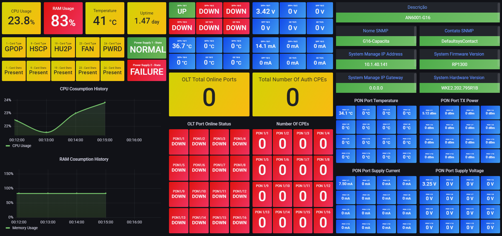

# OLT AN6000-G16


## Configuration: 

On the OLT device the following stepts need to be configurated: 

- Enable the SNMP query to zabbix get the OIDs data. 

Enable the PON's OID data by doing the following command: 

```
port traffic-stats switch traffic enable 5 0 opt enable 5 0 rtt enable 5 0
```